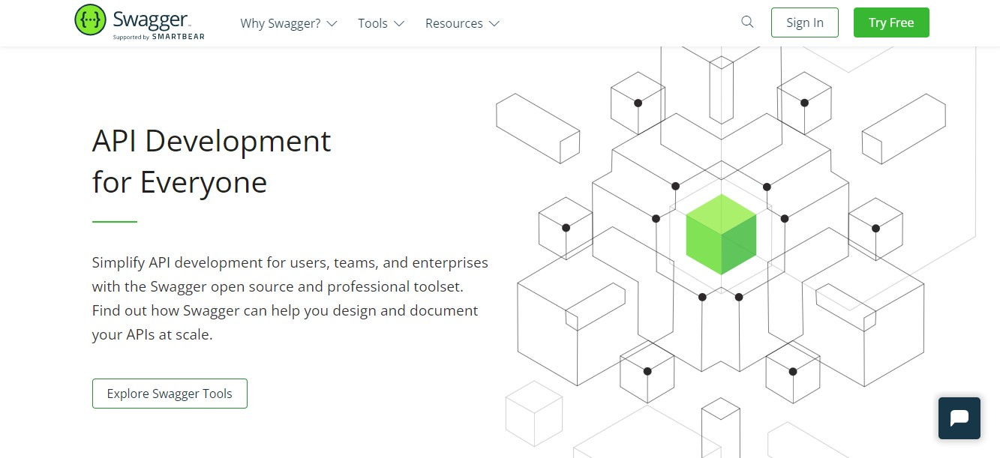

<h1 align="center">
📄 Swagger API Documentation
</h1>

<h1 align="center">
  
</h1>

 O Swagger fornece um conjunto de ferramentas, dentre eles: Swagger Editor para escrevermos a documentação da API, Swagger UI para disponibilizarmos essa documentação e Swagger Codegen para gerar código a partir da documentação.

